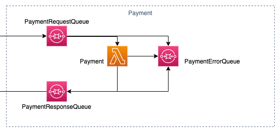

# Payment

> A payment service, because nothing in life is really free...

The Payment service is part of the [ACME Fitness Shop](https://github.com/vmwarecloudadvocacy/acme_fitness_demo). The goal of this specific service is to validate credit card payments. Currently the only validation performed is whether the card is acceptable.

## Prerequisites

* [Go (at least Go 1.12)](https://golang.org/dl/)
* [Mage](https://magefile.org/)
* [An AWS Account](https://portal.aws.amazon.com/billing/signup)
* [AWS CLI](https://docs.aws.amazon.com/cli/latest/userguide/cli-chap-install.html) and [AWS SAM CLI](https://docs.aws.amazon.com/serverless-application-model/latest/developerguide/serverless-sam-cli-install.html) installed and configured

## Quick start

Provided you already have the AWS CLI and the AWS SAM CLI installed and configured, you can run:

```bash
git clone https://github.com/retgits/payment
cd payment
mage deps
```

Update the `mageconfig.yaml` and change the variables with values that match your preferred setup. If you want to use environment variables, use the syntax `$$<variable name>$$`

```yaml
stage: dev
author: retgits
team: vcs
awsS3bucket: $$AWS_S3_BUCKET$$
```

Deploy the function into your AWS account:

```
mage lambda:deploy
```

## Test

You can test the function from the [AWS Lambda Console](https://console.aws.amazon.com/lambda/home) using the test data from the files [`lambda-console-failure.json`](./test/lambda-console-failure.json) and [`lambda-console-success.json`](./test/lambda-console-success.json). Alternatively, you can publish a message to the _PaymentRequestQueue_ created during deployment using the payload from either [`event.json`](./test/event.json) or [`failure.json`](./test/failure.json).

To test before deployment, the command `mage lambda:local` executes functions in a Lambda-like environment locally. The input and events can be passed in by setting the 'tests' variable in the mageconfig file with space separated entries in the form of `<Function>/<input file>` (like `Payment/event.json Payment/failure.json`).

## Events



The function accepts events from SQS on the `PaymentRequestQueue`. These events should contain a payment request, like:

```json
{
    "orderID": "12345",
    "card": {
        "Type": "Visa",
        "Number": "4222222222222",
        "ExpiryYear": 2016,
        "ExpiryMonth": 12,
        "CVV": "123"
    },
    "total": "123"
}
```

Credit card numbers to test with cab be found on the [PayPal](http://www.paypalobjects.com/en_US/vhelp/paypalmanager_help/credit_card_numbers.htm) website.

Whether the validation succeeds or fails, a response is sent to the `PaymentResponseQueue`, with the payload looking like:

```json
{
  "success": "true",
  "status": "200",
  "message": "transaction successful",
  "amount": 123,
  "transactionID": "3f846704-af12-4ea9-a98c-8d7b37e10b54"
}
```

When the card fails to validate, an error message is sent back. More details on why validation has failed is available in the logs:

```json
{
  "success": "false",
  "status": "400",
  "message": "creditcard validation has failed, unable to process payment",
  "amount": "0",
  "transactionID": "-1"
}
```

In case of any errors while processing the message, the message and the event are sent to the `PaymentErrorQueue`.

## Using `Mage`

Most of the actions to build and run the app are captured in a [Magefile](./mage.go)

| Target         | Description                                                                                              |
|----------------|----------------------------------------------------------------------------------------------------------|
| go:deps        | resolves and downloads dependencies to the current development module and then builds and installs them. |
| go:test        | 'Go test' automates testing the packages named by the import paths.                                      |
| lambda:build   | compiles the individual commands in the cmd folder, along with their dependencies.                       |
| lambda:clean   | remove all generated files.                                                                              |
| lambda:deploy  | carries out the AWS CloudFormation commands 'package, 'deploy', and 'describe-stacks'.                   |
| lambda:destroy | deletes the created stack, described in the template.yaml file.                                          |
| lambda:local   | executes functions in a Lambda-like environment locally.                                                 |

## Contributing

[Pull requests](https://github.com/retgits/payment/pulls) are welcome. For major changes, please open [an issue](https://github.com/retgits/payment/issues) first to discuss what you would like to change.

Please make sure to update tests as appropriate.

## License

See the [LICENSE](./LICENSE) file in the repository
